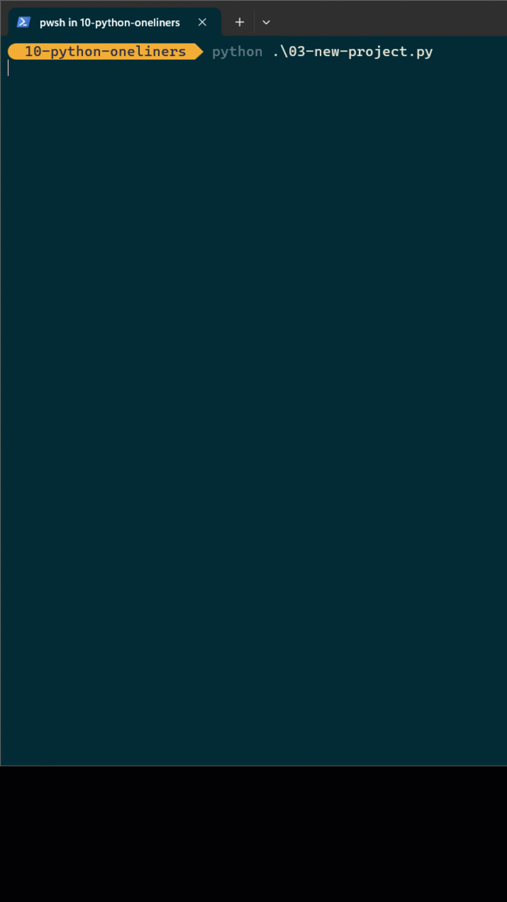

# mcp-rocket

# 🐍 **Instant project setup with a single command!** ✨

Welcome to the most efficient way to bootstrap your Python projects! This one-liner utility automates your entire project setup workflow. 🥊

## 🚀 What's Inside?



### 🛠️ cli.py` - The Project Wizard
A magical project setup tool that:
- 🎯 Creates a new Python project structure
- ⚡ Initializes UV environment automatically  
- 📦 Installs MCP dependencies
- 🚀 Launches VS Code in your new project
- 🎨 Features awesome ASCII rocket art!

## ⚡ Prerequisites

You'll need **UV** (the lightning-fast Python package manager) installed:

```bash
# Install UV if you haven't already
curl -LsSf https://astral.sh/uv/install.sh | sh
```

## 🎮 How to Run

Execute the script with UV for maximum speed and compatibility:

```bash
# Create a new project with style
uv run cli.py
```

## 🎉 Pro Tips

- **Lightning Fast**: UV makes this script start almost instantly
- **Cross-Platform**: Works on Windows, macOS, and Linux
- **Beginner-Friendly**: Perfect for Python newcomers and experts alike
- **Full Automation**: From project creation to IDE launch in seconds

## 🌟 Why This One-Liner?

Sometimes the best solutions are the simplest ones! This script proves that you don't need hundreds of lines of code to be productive. It's:

- ⚡ **Fast to write**
- 🔍 **Easy to understand**  
- 🚀 **Quick to execute**
- 🛠️ **Highly practical**

## 🤝 Contributing

Have improvements for this project wizard? We'd love to see them! Feel free to enhance this productivity booster.

## 📜 License

Do whatever you want with this! Copy it, modify it, share it, tattoo it on your arm – it's yours to use! 🎁

---

**Happy coding!** 🎉 Remember: Sometimes the best code is the shortest code! ⚡


